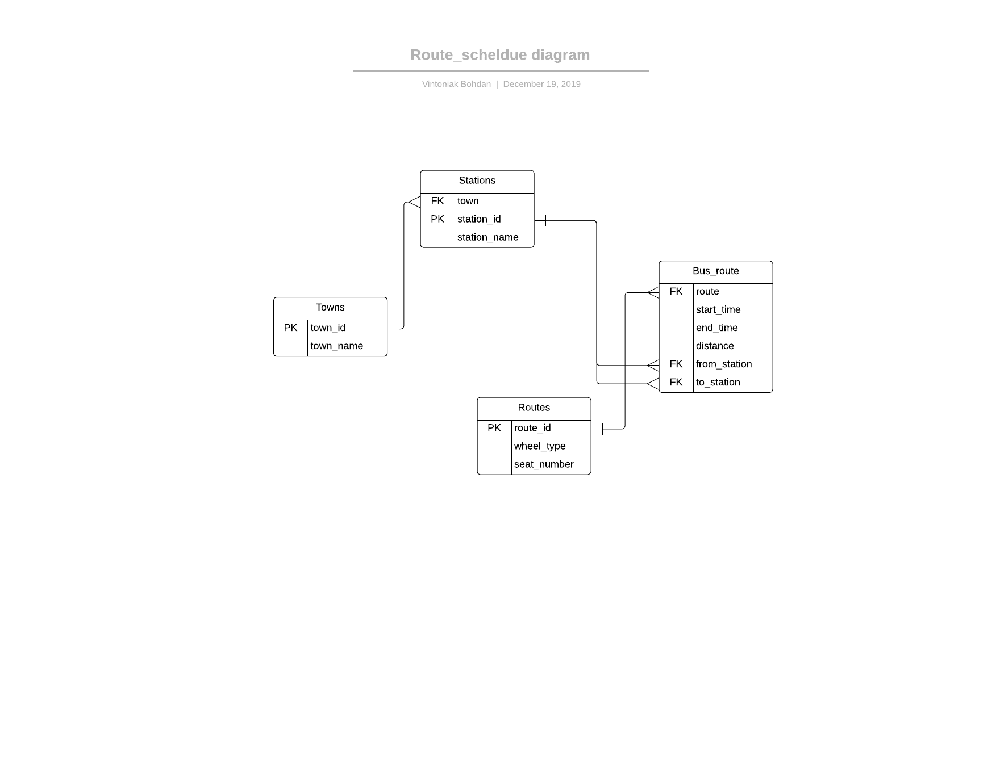

# route_scheldue
## Entity Relatioship(ER) diagram

## Tools
* UBUNTU v18.04
* Pgmodeler
* For creating ER-diagram https://www.lucidchart.com/
* MySQL
## Example of SQL queries
1. Select all stations
```sql
SELECT * FROM Stations;
```

| town | station_id | station_name |
|------|------------|--------------|
|    1 |         11 | Tetralna     |
|    1 |         12 | Petlury      |
|    1 |         13 | Vokzal       |
|    1 |         14 | Kolumba      |
|    2 |         21 | Chornovola   |
|    2 |         22 | Dovchenka    |
|    2 |         23 | Mazepy       |
|    2 |         24 | Sacharova    |
|    2 |         25 | Pochta       |
|    2 |         26 | Bandery      |
|    3 |         31 | Platona      |
|    3 |         32 | Dnipro       |
|    3 |         33 | Dambova      |
|    3 |         34 | Sadova       |

2. Select stations with town
 ```sql
SELECT town_name, station_name FROM Stations JOIN Towns ON Stations.town = Towns.town_id;
```

| town_name       | station_name |
|-----------------|--------------|
| Lviv            | Tetralna     |
| Lviv            | Petlury      |
| Lviv            | Vokzal       |
| Lviv            | Kolumba      |
| Ivano_Frankivsk | Chornovola   |
| Ivano_Frankivsk | Dovchenka    |
| Ivano_Frankivsk | Mazepy       |
| Ivano_Frankivsk | Sacharova    |
| Ivano_Frankivsk | Pochta       |
| Ivano_Frankivsk | Bandery      |
| Kyiv            | Platona      |
| Kyiv            | Dnipro       |
| Kyiv            | Dambova      |
| Kyiv            | Sadova       |

3. Select all stations that belong Ivano_Frankivsk
 ```sql
SELECT town_name, station_name FROM Stations JOIN Towns ON Stations.town = Towns.town_id WHERE town_name like 'Ivano%';
```

| town_name       | station_name |
|-----------------|--------------|
| Ivano_Frankivsk | Chornovola   |
| Ivano_Frankivsk | Dovchenka    |
| Ivano_Frankivsk | Mazepy       |
| Ivano_Frankivsk | Sacharova    |
| Ivano_Frankivsk | Pochta       |
| Ivano_Frankivsk | Bandery      |


